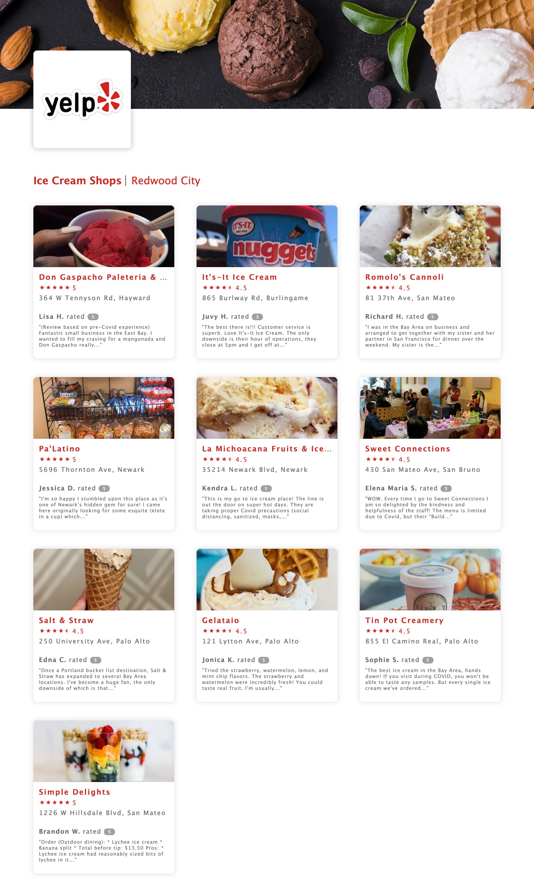

# YelpApp

**I KNOW YOU LOVE ICECREAMS!** :icecream:

Bringing you a simple **Express** application to list top 10 ice-cream shops near you.


## Requirements

- A pair of hands, even one would do the job :open_hands:
- A working machine :computer:
- [Node.js 10+](https://nodejs.org)
`

## Installation

The easiest way to get started is to clone the repository and install the dependencies with npm

```bash
#Get the latest snapshot
git clone git@github.com:nitish1099/yelpapp.git myProject

#Change directory
cd myProject

#Install dependencies
npm install
```

## Usage

```bash
#Starts the application on port 8080
npm start

#Open the url in your favorite browser to view the webpage
http://location:8080

#API endpoint for the mobile app
http://localhost:8080/api
```

## Screenshot


## Demo
[Demo]x(https://www.loom.com/share/a44dc70b584b47d1a30ab31010a9b6d7)